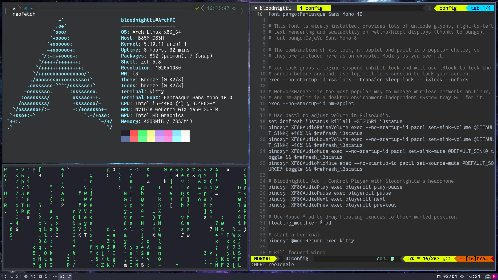

  <h1 align="center">Hi ,Bloodnighttw,here 👋</h1>

  

  <h2 align="center">Introduction Myself👋</h2>

- I'm EDM Lover.
- Also,I'm Vim Lover,and I use Arch,btw.

### My works
1.  [bloodnighttw/dotfile](https://github.com/bloodnighttw/dotfile)

<!--
**bloodnighttw/bloodnighttw** is a ✨ _special_ ✨ repository because its `README.md` (this file) appears on your GitHub profile.

Here are some ideas to get you started:

- 🔭 I’m currently working on ...
- 🌱 I’m currently learning ...
- 👯 I’m looking to collaborate on ...
- 🤔 I’m looking for help with ...
- 💬 Ask me about ...
- 📫 How to reach me: ...
- 😄 Pronouns: ...
- ⚡ Fun fact: ...
-->
